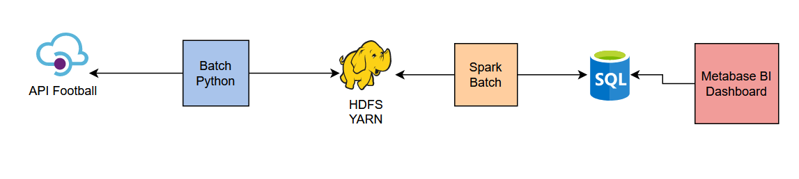

# api-football-data-project

Ce projet a pour objectif d'analyser et de comparer les performances des  joueurs de football avec l'api-football

> Info: Pour des raisons de compatibilités, le datalake utiliser est S3 (à la place de hdfs). L'outil de dashboard sera grafana, metabase est payant pour les fonctionnalités que nous voulons utiliser

## Description
Le projet est composer de plusieurs éléments:

* `batch-python` : permet de scraper les données de l'api football et les pousser sur HDFS
* `spark-analysis` : batch qui va analyser les données dans le S3 et les formaliser dans une base de données SQL
* `base SQL`: Une base postgres ou lesoutput de Spark sont stocker
* `metabase` : Dashboard pour visualiser les données dans la base SQL

## Arborescence
* `batch-python/` : application batch python
* `spark-analysis/` : application Spark en Java
* `infrastructure/` : configuration de la base de données
* `metabase/` : configuration des dashboard metabase

## Architecture



## code
- Dans le batch-python, le script `update-database.py` fait des appels à l'api-football tout les jours. il y'aura seulement 2 joueurs analyser car l'api nous limite en requêtes. Si besoin modifier la clé API pour que cela fonctionne
## Installation

Tous ce fait avec Docker compose, lancez simplement la commande suivante:
```bash
docker compose up
```
les variables `API_HOST` & `API_KEY` sont modifiables dans le docker compose

## Screen/Demo